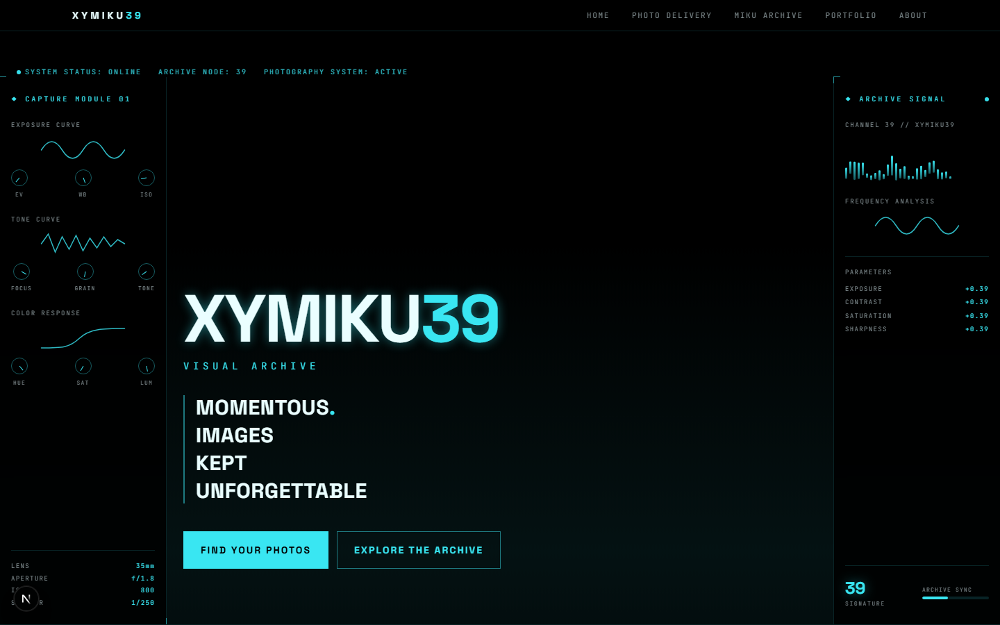
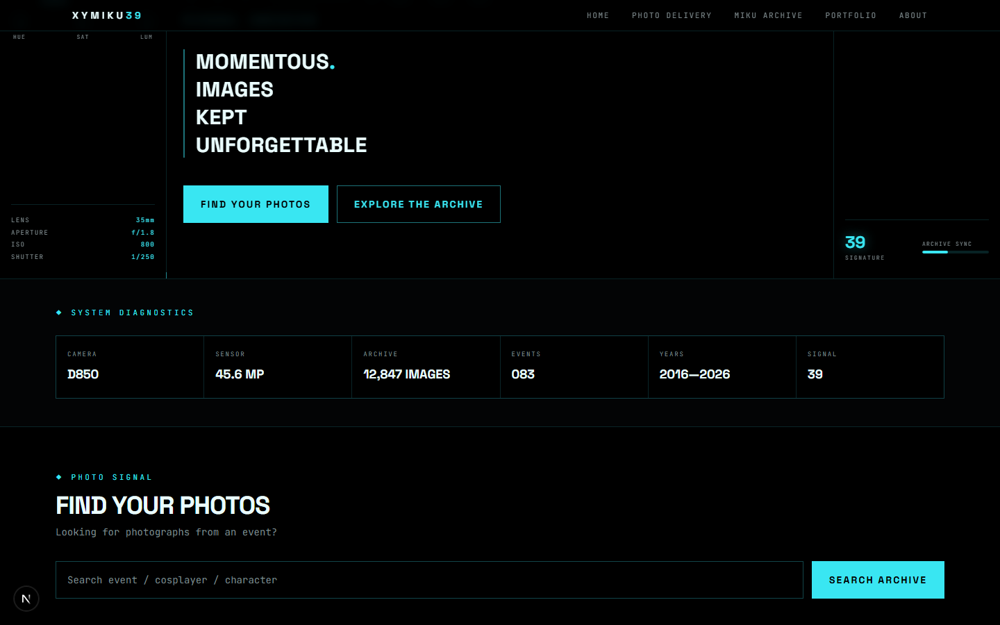
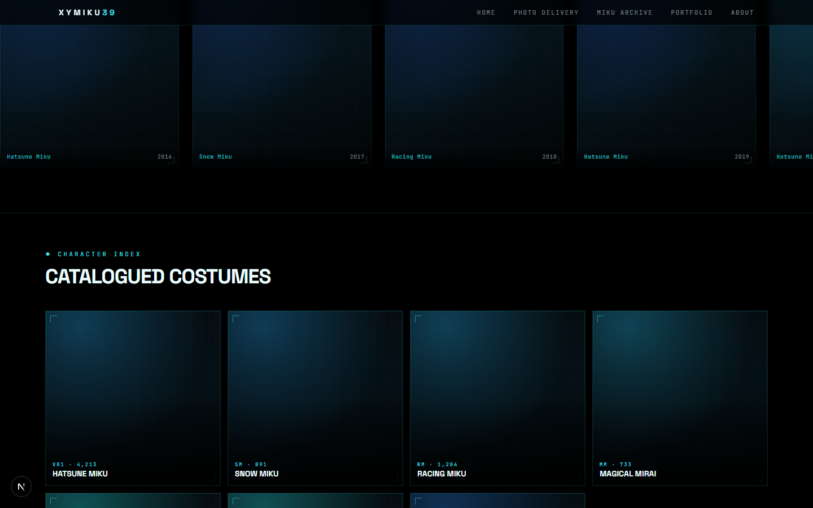

<div align="center">



# XYMIKU39

**MOMENTOUS IMAGES KEPT UNFORGETTABLE (M.I.K.U.)**

A photography portfolio site for a Hatsune Miku cosplay photographer, styled
as a retro-futuristic "archive console" — boot sequences, scanlines,
HUD-style corner brackets, waveform decorations, and terminal/diagnostics
jargon framing each gallery as a piece of retrieved signal data. "39" recurs
throughout as the site's signature motif.

[](https://nextjs.org)
[](https://react.dev)
[](https://www.typescriptlang.org)
[](https://tailwindcss.com)

</div>

---

## Screenshots

|                               System diagnostics & photo search                                |                                 Archive timeline & character index                                  |
| :----------------------------------------------------------------------------------------------: | :--------------------------------------------------------------------------------------------------: |
|  |  |

> Every panel above is real UI, rendered live — but every *image* in it (thumbnails,
> character cards) is currently a generated CSS gradient standing in for a real
> photo. See [Current State](#current-state) below.

## Tech Stack

- [Next.js 16](https://nextjs.org) (App Router, static export target)
- [React 19](https://react.dev)
- TypeScript
- [Tailwind CSS v4](https://tailwindcss.com) (`@theme` design tokens in
  `app/globals.css` — cyan/black HUD palette)
- [Framer Motion](https://www.framer.com/motion/) for boot-sequence and
  scroll animations
- Fonts: Space Grotesk (display) + JetBrains Mono (technical/HUD text)
- Deployment target: [Zeabur](https://zeabur.com) (prebuilt static export)

## Features

- **Boot-sequence hero** — an animated diagnostic startup screen gives way to
  the main hero, flanked by HUD side panels (capture-module dials, archive
  signal waveform, live parameter readouts).
- **System diagnostics strip** — a stat grid (camera body, sensor resolution,
  archive size, years active) framed as machine telemetry rather than a plain
  "about" blurb.
- **Photo delivery search** — a "find your photos" bar for looking up a shoot
  by event / cosplayer / character (UI complete, backend not yet wired — see
  roadmap).
- **Archive timeline** — a horizontal-scrolling history of past shoots by
  year.
- **Character index** — a catalogued grid of cosplayed characters with
  per-character shoot counts and codes.
- **Featured cosplay & portfolio** — masonry-style featured-work grid plus
  categorized portfolio sections.
- **Sticky HUD navigation** — animated mobile hamburger menu, in-page anchor
  links to every section.
- **Fully responsive HUD chrome** — scanlines, corner brackets, and waveform
  decorations that hold up across viewport sizes.

## Current State

The homepage (`app/page.tsx`) composes these components in order:

| Component | Status | Description |
|---|---|---|
| `Header` | Done | Sticky nav with an animated mobile hamburger menu; links to real in-page anchors. |
| `Hero` | Built, mock content | Animated boot sequence, HUD side panels, waveform decorations. |
| `SystemDiagnostics` | Built, mock content | A stat grid framed as system diagnostics. |
| `PhotoDelivery` | UI done, not wired up | A "find your photos" search form — currently a no-op (`preventDefault` only, no real search). |
| `ArchiveTimeline` | Built, mock content | Horizontal-scroll timeline of shoot history. |
| `ArchivePlaceholder` | **Explicit placeholder** | Renders a generated gradient in place of a real photo — a documented stand-in until the archive is wired to real images. |
| `CharacterIndex` | Built, mock content | Grid of cosplayed characters. |
| `FeaturedCosplay` | Built, mock content | Masonry-style featured-work grid. |
| `Portfolio` | Built, mock content | Categorized portfolio sections. |
| `VisualSynthesis` | Built, mock content | Two-column HUD key/value panel, mostly decorative flavor text. |
| `MikuSignature` | Done | Stylized brand/signature panel — purely decorative, no data dependency. |
| `Footer` | UI done, not wired up | Social links (Instagram, Twitter/X, Email) currently point to `href="#"`. |

**Every image on the site is currently a generated CSS gradient, not a real
photo** — all content (timeline entries, character list, featured work,
portfolio pieces, diagnostics stats) is sourced from a single static file,
`lib/mock-data.ts`, which is explicitly commented as mock/placeholder data.

## Getting Started

> **Note:** if your working copy lives under a synced cloud-drive folder
> (Google Drive, OneDrive, etc.), `npm install` can fail or behave
> unreliably there. Clone/copy the project to a local, non-synced path
> first (e.g. `~/dev/xymiku-site`) and develop from there.

```bash
npm install
npm run dev
```

Open [http://localhost:3000](http://localhost:3000) to see it. Edit
`app/page.tsx` or any file in `components/` — both hot-reload.

| Script | Purpose |
|---|---|
| `npm run dev` | Start the dev server with hot reload. |
| `npm run build` | Production build (static export, per `next.config.ts`). |
| `npm run start` | Serve the production build. |
| `npm run lint` | Run ESLint. |

## Roadmap

Rough order, subject to change:

- [ ] **Real photography** — replace every `ArchivePlaceholder` gradient
      with actual images (via `next/image`) once a source/CDN for the real
      cosplay photos is decided.
- [ ] **Real content pipeline** — replace `lib/mock-data.ts` with a real
      data source (CMS, MDX/JSON content files, or a small backend) for
      timeline entries, characters, featured work, and portfolio pieces.
- [ ] **Working photo search** — implement the `PhotoDelivery` search form
      (currently `preventDefault`-only) against whatever the real photo
      index/backend ends up being.
- [ ] **Live footer links** — point the Instagram/Twitter/Email links at
      real destinations.
- [ ] **Real diagnostics data** (optional/flavor) — decide whether
      `SystemDiagnostics`' stats stay purely decorative or reflect something
      real (shoot count, years active, etc.) pulled from the same content
      source as the rest of the site.
- [ ] **SEO & metadata** — Open Graph/Twitter card images, page titles,
      structured data for the portfolio.
- [ ] **Accessibility pass** — keyboard nav through the animated menu and
      timeline, alt text once real images exist, motion-reduce handling for
      the boot-sequence/scroll animations.
- [ ] **Mobile QA** — verify the HUD layout, waveforms, and horizontal
      timeline scroll at small viewport widths.
- [ ] **Deployment** — Zeabur deploy + custom domain.
- [ ] **Analytics** (optional) — basic visit/engagement tracking once the
      site is live with real content.

## Changelog

This project follows [Semantic Versioning](https://semver.org/). All notable
changes are recorded below; dates reflect the corresponding commit.

### [Unreleased]

- HUD side panels added to the hero, evolving the cockpit aesthetic
  (capture-module dials, archive signal waveform, live parameter readouts).

### 0.1.0 — 2026-09-15

- Initial build: XYMIKU39 visual archive landing page, with all sections
  listed in [Current State](#current-state) built against mock data.
- Static export enabled for Zeabur prebuilt deployment.

## Learn More

- [Next.js Documentation](https://nextjs.org/docs)
- [Tailwind CSS v4 Documentation](https://tailwindcss.com/docs)
- [Framer Motion Documentation](https://www.framer.com/motion/)
